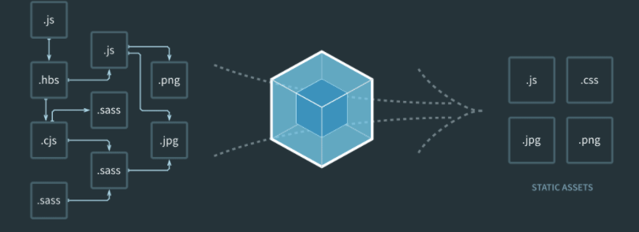
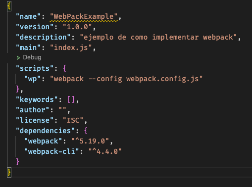

# WEBPACK


en resumen webpack se encarga de empaquetar todos los archivos y crear otros.

esta configuracion webpack fue creada para Crear proyectos FullstackMVC pero con el backend/frontend por separado por lo que se hace necesario enviar archivos de frontend a alguna carpeta del backend para la ejecucion correcta de vistas.

### como agregar webpack a mi proyecto 

*Descripcion:*
- crear estructuras y archivos
- inicialize con npm init --y
- crear configuracion webpack e testear

# *Guia / Pasos:*
- crear backend y frontend   
---backend   
------index.js       
------public        **necesario**  
------src  
---frontend  
------index.html  
------app.js         **necesario**  
------UI.js  
------styles  
------services  
------modules  
- npm init --y  

- crear webpack.config.cjs y configurarlo con :

**entry   = archivos a convertir**
**output = archivos convertidos**

```
var path = require('path');

module.exports = {
    mode: 'development',
    entry: './frontend/app.js',
    output: {
        path: path.resolve(__dirname, './backend/public'),
        filename: 'foo.bundle.js'
    }
};
```

- crear script en package json

```
  "scripts": {
    "wp": "webpack --config webpack.config.cjs"
  },
```



- instalacion (basica)
  npm i webpack webpack-cli

- ejecutar script configurado
  
```
npm run wp
```


el comando npm run wp ingresa a package.json y ejecuta 'wp' lo que ejecuta webpack y le asigna una configuracion (la creada en la raiz).


# fin

### Upgrade (html,css,js con webpack)  
webpack webpack-cli  `webpack basico`  
html-webpack-plugin   `procesa el html`  
css-loader style-loader mini-css-extract-plugin `procesa el css`  
webpack-dev-server @webpack-cli/init  `servidor para ejecutar webpack`  
timeago.js  `fechas ,  pero nose si lo usare , creo que no`  
-D `instala esto en package json solo como develpment y no para produccion`  


# Mi scrip usado 
```
npm   i  webpack webpack-cli html-webpack-plugin css-loader     style-loader mini-css-extract-plugin webpack-dev-server  @webpack-cli/init  timeago.js -D
```
